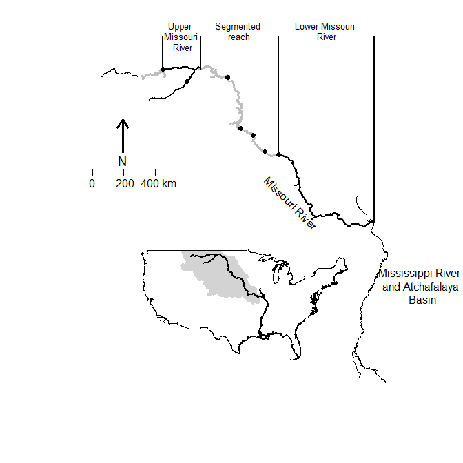

# About the PSPAP

## About the PSPAP

The Pallid Sturgeon Population Assessment Program (PSAPS) began in 2003.
Current population assessment overview
Background and implementation
The PSPAP program began in 2003 
Ramped up in xxx The Pallid Sturgeon


## Spatial extent, grain, organization, and sampling

Missouri River pallid sturgeon recovery is limited to the upper and lower Missouri
 River segments, Recovery Priority Management Areas 2 and 4 respectively (Figure 1.1).
These segments are 
The upper and lower Missouri River segments are xx km and xx km respectively (Table 1.1).

<!--
add a figure of Proportion sampled for each year
add a figure of year and each bend with 0---0 for each sampling occasion.  ------0---0---0
-->

Segments within RPMAs (Table 1.1)

Bends within segments

The spatial grain of the monitoring program is the river bend, defined as {welker and drobish}.
 major segment.
Within each segment, 25% of bends are randomly sampled annually.
*It is unclear whether a bend can be resampled the following year*

```{r echo=FALSE, out.width="95%"}

```

Figure 1.1. Major Missouri River pallid sturgeon management units.
The Pallid Sturgeon Population Assessment Program is implemented in the upper,
 segmented, and lower Missouri River.


*Figure 1.2. Upper and lower Missouri River segments establishing the spatial extent  of Missouri River pallid sturgeon recovery. Alternating gray and black line segments denote river bends that serve as the  spatial grain and sampling unit for population and demographic estimates.*

 
Table 1.1.


Existing evaluations
Other considerations
Length, weight,
Current assessment and AM
The objectives are:

Fundamental Objective: Avoid jeopardizing the continued existence of the pallid sturgeon from the US
Army Corps of Engineers actions on the Missouri River.

Sub-objective 1: Increase pallid sturgeon recruitment to age 1.

1. Metrics: primary metric is catch rates of age 0 and age 1 pallid sturgeon;
2. secondary metrics include model-based estimates of abundance of age 0 and age 1 pallid sturgeon, and the survival of hatchery and naturally reproducing fish to age 1.

Sub-objective 2: Maintain or increase numbers of pallid sturgeon as an interim measure until sufficient and sustained natural recruitment occurs.

Study objectives
Pallid Sturgeon only...

The objectives of this study are to:

* provide potential approaches that will meet population objective
* feed into ongoing adaptive management
* build on or cross walk
