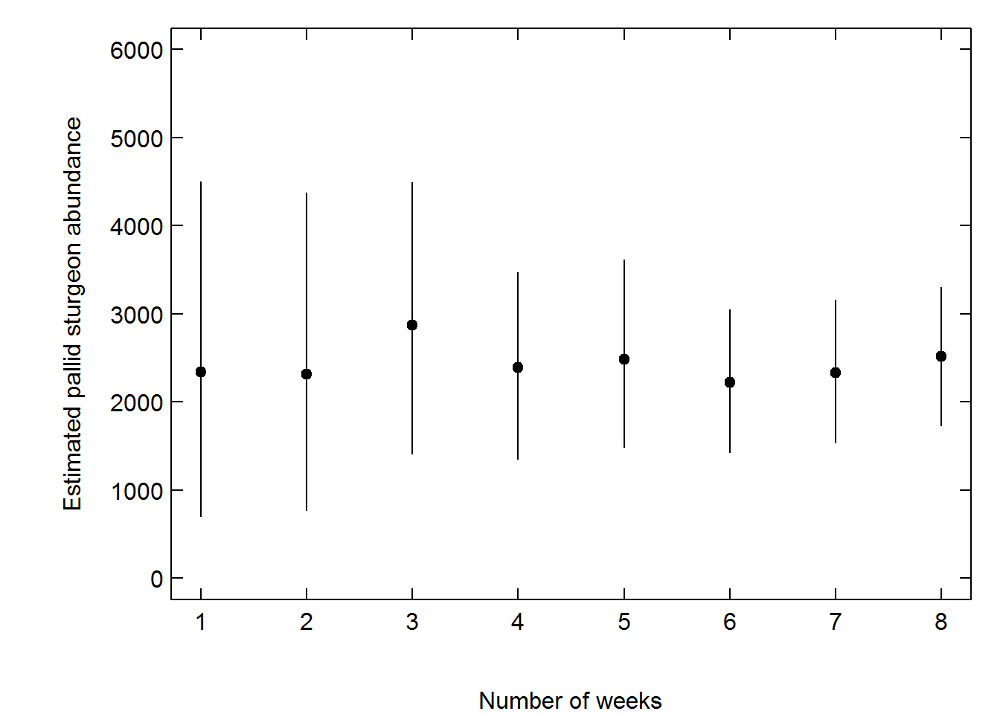

  
<!---
  rmarkdown::render_site("2018-05-09-phase1-pilot.Rmd")# build website
--->
  

Since March the USACE PSPAP crew has been sampling 2 bends per week in Segment 14 and the segment was completed last week!  The sampling was a bit different from standard PSPAP protocols. Specifically the crew set 8 gear deployments (gill nets or trotlines) each day throughout the bend.  The crew set gears in locations to maximize catch and ensure spatial coverage within the bend. Catch was good, early on, especially for shovelnose sturgeon where in some cases over 500 shovelnose were captured over the 3 sampling occasions! This was good because shovelnose sturgeon were floy tagged on the first and second occasion so that capture probability could be estimated. The recapture numbers were good for shovelnose but lousy for pallid sturgeon. In total 17 pallid sturgeon were captured for the entire segment 14 effort and none were recaptured.  This is not unexpected. When there is a rare species in low abundance compounded by low capture probability you would need many occasions to have any probability of recapturing a marked individual.  For some of the preliminary capture probabilities—all estimates are a work in progress and may change—a field crew would need 100 occasions to expect to recapture a pallid sturgeon! Certainly an unrealistic field constraint. Fortunately shovelnose are abundant and the number of tagged fish can help with capture probability estimates. Specifically if you can tag more fish you increase the probability of recapturing a fish.  


This effort has been a tremendous learning experience.  As part of the effort the technical team received the field data for captures and recaptures on Friday and was able to generate bend- and segment-level estimates of abundance in close to real time.  See https://mcolvin.github.io/phase-1-pspap/ for a look at the weekly report that was generated and updated each week with new data.  We were especially interested in the figure below, taken from the weekly report, where you can see the decrease in uncertainty around the segment-level abundance estimates after each week of new data came in.  


```{r,echo=FALSE}

```

With each week, the report became more comprehensive and estimates of several population metrics identified during the PSPAP workshop were estimated including size structure, origin, and -- pending genetic analysis -- we should be able to get some estimation of the proportion of the population that are hybrids. There is still much information we are synthesizing from this effort. In particular, we are looking at the relationship of catch per unit effort and abundance, gear effectiveness, effects of environmental covariates on capture probability, and so on. If you have not already, go to https://mcolvin.github.io/phase-1-pspap/ and check out some of the preliminary outputs, just keeping in mind there is still much ongoing work to improve and evaluate estimates! The estimation details are similar to those presented in the progress report but implanted using a Bayesian approach so that all the metrics can be simultaneously estimated.  
