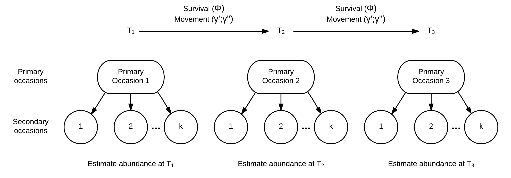
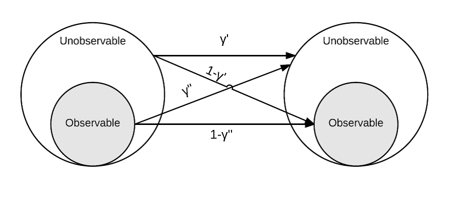

<!---
rmarkdown::render_site("_2017-06-XX-RD-and-closure.Rmd")# build website
--->

```{r,eval=FALSE,echo=FALSE}

source("R/6-analysis-RD-and-Closure.R")
input<-list()
input$nprim = 10
input$phi=rep(0.8,input$nprim)## SURVIVAL
# FECUNDITY
input$f=rep(0,input$nprim)
input$n=1000 # initial population size
input$n_inn=600 # initial number in study area
## RANDOM MOVEMENT PRIMARY
input$gam_prime=rep(0.95,input$nprim) # UNOBSERVABLE[t-1]--> UNOBSERVABLE[t]
input$gam_d_prime=1-input$gam_prime # OBSERVABLE[t-1] --> UNOBSERVABLE[t]
input$nsec=rep(4,input$nprim)## SECONDARY OCCASIONS
## RANDOM MOVEMENT SECONDARY
input$gam_d_prime2<-rep(0,input$nprim) # OBSERVABLE[t-1] --> UNOBSERVABLE[t]
input$gam_prime2<- 1-input$gam_d_prime2# UNOBSERVABLE[t-1]--> UNOBSERVABLE[t]
input$p=rep(0.3,input$nprim)## CAPTURE PROBABILITY
inputs<-input
ch<-sim_ch(inputs=input)
ests<-est_rd(inputs=ch)

tmp<-c()
for(i in 1:20)
    {
    out<-sim_rd_ch(n=input$n, 
        n_unobservable=input$n-input$n_inn, 
        nprim=input$nprim,
        nsec=input$nsec,
        phi=input$phi,
        gamma_prime=input$gam_prime,
        gamma_dblprime=1-input$gam_prime,
        p=input$p) 

        

    rd<-process.data(data=out$ch, model="Robust", 
        time.intervals=out$occs)
    rd_ddl<-make.design.data(rd)

    S=list(formula=~1)# SURVIVAL
    # SHARE = TRUE TO SET C = P
    p=list(formula=~1,share=TRUE)# CAPTURE PROBABILITY
    f0<- list(formula=~time) # NUMBER NOT ENCOUNTERED
    GammaDoublePrime=list(formula=~1)
    GammaPrime=list(formula=~1)
    fit<-mark(data = rd, 
        model = "Robust", 
        time.intervals=time.intervals,
        model.parameters=list(
            S=S,
            GammaDoublePrime=GammaDoublePrime,
            GammaPrime=GammaPrime,
            p=p),
        threads=2,
        brief=TRUE)
    derived<- fit$results$derived$`N Population Size`    
    tmp<- cbind(tmp,plogis(summary(fit)$beta$estimate)[1:4])
    }

hist(c(tmp[1,]))
hist(c(tmp[2,]))
hist(c(tmp[3,]))
    
combos<- expand.grid(gam_d_prime2=0,#seq(0,0.5,by=0.05),
    reps=c(1:10))
nn<-pp<-data.frame()
for(i in 1:nrow(combos))
    {
    input$gam_d_prime2<-rep(combos$gam_d_prime2[i],input$nprim) 
    input$gam_prime2<- 1-input$gam_d_prime2
    ch<-sim_ch(inputs=input)
    ests<-est_rd(inputs=ch)  
    parms=data.frame(
        rep=i,
        gamma2=input$gam_d_prime2[1],
        gammaTrue=input$gam_d_prime[1],
        gammahat=ests$parameters[ests$parameters$parameter=="GammaDoublePrime:(Intercept)",]$ests,
        ptrue= input$p[1],  
        phat= ests$parameters[ests$parameters$parameter=="p:(Intercept)",]$ests,
        Strue=input$phi[1],
        Shat=ests$parameters[ests$parameters$parameter=="S:(Intercept)",]$ests)
    abund<-data.frame(
        rep=i,
        gamma2=input$gam_d_prime2[1],
        year=c(1:input$nprim),
        Ntrue=colSums(ch$Z_inn),        
        Nhat= ests$abundance$derived.estimate)
    pp<- rbind(pp,parms)
    nn<-rbind(nn,abund)
    }

write.csv(pp,"output/RD-daily-movement-output-parameters.csv")
write.csv(nn,"output/RD-daily-movement-output-abundance.csv")
```


# Model 3 = no TE 
# fix Gamma's = 0
GammaDoublePrime.zeroTE=list(formula=~1, fixed=0, share=TRUE)


```{r,echo=FALSE}
pp<-read.csv("output/RD-daily-movement-output-parameters.csv")
pp$rep<- c(1:nrow(pp))
nn<-read.csv("output/RD-daily-movement-output-abundance.csv")
nn$year<- rep(c(1:10),nrow(pp))
nn$rep<- sort(rep(pp$rep,10))
nn$bias<- nn$Nhat-nn$Ntrue
nn$pbias<- (nn$Nhat-nn$Ntrue)/nn$Ntrue
xx<- aggregate(cbind(bias,pbias)~gamma2+rep,nn,mean)
```

### In a nutshell

### Engage in the process

### Background overview

In a previous post we looked at the effect of violating the assumption 
of closure. Specifically, when Pallid Sturgeon move in and out of a bend 
on a daily basis. The analysis showed that as daily movement rates 
increased there was a positive bias associated with abundance estimates 
using the M0 abundance estimator for capture mark recapture approaches
[see here](https://mcolvin.github.io/PSPAP-Reboot/2017-06-28-M0-and-closure.html). 

To date the team has evaluated varying monitoring approaches identified 
during the workshop including catch effort and closed population 
estimators. One alternative to a catch effort program or estimating 
abundance using a cmr estimator like the M0 model is the robust design. 
The robust design is similar to the M0 estimator it that it estimates 
abundance assuming a short period of closure but also can estimate 
demographic rates like survival ($\varphi$) and movement rates 
($\gamma^\prime$ and $\gamma^\prime\prime$) among primary occasions. The 
idea of primary and secondary occasions are illustrated in the figure 
below. 


```{r,out.width='90%'}

```

The parameters estimated by the robust design include:

* $\varphi$ the probability of surviving between primary occasions, 
* $\gamma^{\prime}$ the probability of being outside the study area and unavailable for capture during the primary occasions given the animal was not present during the previous primary occasions given it survives to the current occasion (Figure 2),
* $\gamma^{\prime\prime}$ is the probability of being outside the study area and unavailable for capture during the primary occasions given the animal was present during the previous primary occasions given it survives to the current occasion (Figure 2),
* $c$ is the initial capture probability, and
* $p$ is the capture probability.


Pallid Sturgeon are allowed to move around among primary occasions and 
the $\gamma^{\prime}$ and the $\gamma^{\prime\prime}$ are illustrated in 
the figure below. The gist is that the parameters are transition 
probabilities. There are varying ways to specify movement but the most 
common one used is random and has been used for Pallid Sturgeon [@WS14, 
@SPP12]. 

```{r,out.width='90%'}

```

Despite the flexibility among primary occasions, the estimator does 
assume that the population is closed. Relevant assumptions for the 
secondary occasion within a primary occasion (i.e., periods of where 
closure is assumed) are: 

1. Stay put (Emigration = 0),
2. New fish do not enter the bend (Immigration = 0), 
3. New fish are not recruited (Recruitment = 0), and 
4. Fish do not die (Survival = 1).

We also assume:

1. Fish do not lose tags,
2. We detect tags perfectly, and
3. Capture probability is equal among fish. 


If bends are used as the sampling unit there may be some effect of day 
to day movement on abundance and demographic rate estimates. Given the 
results of daily movement on the closed population estimator it seems 
likely that abundance will be overestimated with increased daily 
movement however it is not clear how movement will effect survival and 
movement among primary occasions. To be clear, estimated movement rate 
is for primary occasions which is different that daily movement rate. In 
the robust design daily movement rate is assumed to be 0 (i.e., fish stay put). 


### Objectives and approach

The objectives of this analysis were to evaluate the effect of 
daily movement on estimates of abundance, survival, movement rate and capture 
probability. 

To evaluate the effect of daily movement we simulated a cmr dataset
for a 10 year period representing a single bend. The true parameters 
used to simulate the dataset were:

* $\varphi$ = 0.8 (survival)
* $\gamma^\prime$ = 0.7 (probability of staying outside fo the bend)
* $\gamma^{\prime\prime}$ = 0.3 (probability of moving out of bend) 
* $p$ = 0.3 (capture probability)

For simplicity all parameters were assumed to be constant among years. 
The initial population was 1000 fish with 300 of those Pallid Sturgeon 
occupying the bend. Daily movement rates of 0 to 0.5 in increments of 
0.05 were used to simulate 100 replicate cmr dataset and abundance, 
survival, movement, and capture probability estimated using a robust 
design estimator in Program Mark. 


### Effect of violating closure assumption

Not surprisingly, as daily movement rate increased, estimated bend-level 
abundance increased. This was a similar result to the analysis of the M0 
model. The figure below illustrates the effect of daily movement on 
bend-level abundance estimates over time. The red lines are 100 
replicates of true population dynamics and the black lines are the 
estimated dynamics. As daily movement rate increases the gap between the 
black and red lines increases illustrating the positive bias. 


```{r,echo=FALSE}
trans_black<- rgb(0,0,0,alpha=40,maxColorValue=255)
trans_red<- rgb(255,0,0,alpha=40,maxColorValue=255)
par(mfrow=c(4,3),mar=c(1,2,1,1),oma=c(4,4,1,1))
for(g2 in unique(nn$gamma2))
{
plot(Nhat~year,nn,type='n',las=1)
lapply(unique(nn$rep),function(x)
    {
    points(Nhat~year,nn,subset=rep==x& gamma2==g2,col=trans_black,type='l')
    points(Ntrue~year,nn,subset=rep==x & gamma2==g2,col=trans_red,type='l')
    })
mtext(side=3, paste("Daily movement rate = ",g2,sep=""),line=-1,cex=0.65)
    }
plot.new()
legend("center", c("True abundance", "Estimated abundance"),
    col=c(trans_red, trans_black),lty=1,lwd=3)
mtext(side=1, "Year",outer=TRUE,line=2)
mtext(side=2, "Abundance",outer=TRUE,line=2)
```

In the figure above, we can calculate the bias of each yearly estimate 
for each rep where bias is the estimated abundance minus the true 
abundance. Fortunately this is simulated data, so we know what the true 
abundance is! Bias can then be viewed with fish as the units, 
for example the estimate overestimated true abundance by 200 Pallid 
Sturgeon or bias can be scaled proportionally. Proportional bias allows 
and apples to apples comparison of the abundance estimates as a 
percentage. For example, a bias of 50 pallid sturgeon if the true 
abundance was 80 is different than if the true abundance was 5000. 

Proportional bias is illustrated in the figure below where proportional 
bias was calculated for the plot above. 

```{r,echo=FALSE,cache=TRUE}
trans_black<- rgb(0,0,0,alpha=40,maxColorValue=255)
par(mfrow=c(4,3),mar=c(1,2,1,1),oma=c(4,4,1,1))
for(g2 in unique(nn$gamma2))
{
plot(pbias~year,nn,type='n',las=1)
lapply(unique(nn$rep),function(x)
    {
    points(pbias~year,nn,subset=rep==x& gamma2==g2,col=trans_black,type='l')
    })
mtext(side=3, paste("Daily movement rate = ",g2,sep=""),line=-1,cex=0.65)
    }

mtext(side=1, "Year",outer=TRUE,line=2)
mtext(side=2, "Proportional bias",outer=TRUE,line=2)
```

Using the proportional bias values illustrated above we can get the average
bias for each replicate, thus characterizing bias over the 10 year monitoring 
period. Using the mean proportional bias values we can visualize the 
effect of increasing daily movement rates on bend-level abundance estimates for a 
10 year period.


```{r,echo=FALSE,warning=FALSE, message=FALSE}
boxplot(bias~gamma2,xx,las=1, 
    ylab="Bias (Number of fish)", xlab="Movement rate")
```

We can look at how estimates of survival, movement,
and capture probability are effected by daily movement as well.

```{r}
boxplot(gammahat~gamma2,pp,ylim=c(0,1))
abline(h=unique(pp$gammaTrue))
boxplot(Shat~gamma2,pp,ylim=c(0.7,0.9))
abline(h=unique(pp$Strue))
boxplot(phat~gamma2,pp)
abline(h=unique(pp$ptrue))
```


 


