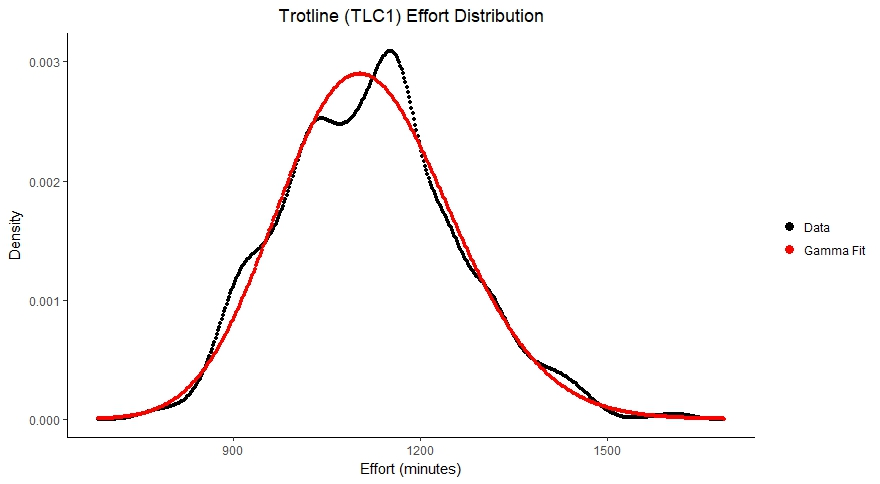

C:\Users\mcolvin\Google Drive
<!--
rmarkdown::render("_Catch-Data.Rmd",output_format='word_document')# build page
-->


```{r, warning=FALSE, include=FALSE}
source("_R/1_global.R")
source("_R/2_functions.R")
effort_data<-TRUE   # NEEDED TO CREATE TABLE 2... COMMENT THIS & TABLE 2 OUT TO SAVE TIME
source("_R/3_load-and-clean.R")
source("_R/5_tables.R")
```
file.path(Sys.getenv("USERPROFILE"),"Google Drive/Pallid-Sturgeon/analysis-effort/pallids.accdb")

# Overview

Simulated catch data was essential to deriving estimates of population abundance and 
trend using various estimators.  It is because we could compare the estimates from 
simulated catch data to the underlying reference population, that we were able to 
evaluate estimator accuracy and precision.  Therefore, simulating catch data was a 
key component of evaluating varying monitoring designs and their ability to achieve 
the fundamental objectives identified during the first population assessment program 
workshop (See Section ??).

The catchability and capture probability of particular gears are important elements of simulating catch data.  Since these values are highly uncertain, we simulate catch data over a range of gear catchabilities.

### Objectives

The objectives of this analysis were to:

1. Simulate 10 years of bend sampling data (i.e. which bends are sampled during which years) for various monitoring designs, 
2. Simulate 10 years of catch data for various sampling strategies using bends as the spatial scale, 
3. Include information in the catch data that could be reasonably assessed by sampling crews in the field and is relevant to meeting fundamental or sub-objectives,
4. Allow gear catchability to vary over a wide range of values in order to evaluate its effect on monitoring design outcomes, and
5. Simulate several catch data tables per combination of reference population and monitoring design.

### Major Assumptions
1. All fish can be uniquely identified.  
2. Fish ids are not lost or overlooked.
3. The sampling protocol is followed without exception. 
4. Expected catch, $C$ can be approximated as $C=qfN$, a function of gear catchability, $q$,
effort described as the time in minutes a gear is deployed, $f$, and the population size, $N$.
5. Gear deployments are independent of one another and do not interact. 
<!--Currently we have the following, but are planning to make simulations with selective gears.
6. Gears are not size selective.
-->

Assumptions 1 and 2, while unlikely to be perfectly met, are reasonable assumptions 
for working with pallid sturgeon (ref) and are typical assumptions made when working 
with capture-recapture data (ref).  For a well designed sampling protocol, 
assumption 3 is also a reasonable, although we recognized that it may not be perfectly 
met due to safety or other unforeseen issues. 

Describing expected catch as in assumption 4: 
$C=qfN=pN$, where $p$ is the capture probability and $p=qf$, is also a commonly made assumption (ref).  This equation is likely a good approximation for small effort 
values ($f$); however, it is clear that as effort increases without bound, capture 
probability ($p$) will become greater than 1 for fixed $q$.  In other words, the model 
$C=qfN$ breaks down for large effort values, and therefore, we must be cautious drawing 
conclusions from outcomes that were generated from large effort values.  To indirectly 
account for this we have flagged cases in our simulations where the capture probability 
is abnormally high.

To understand assumption 5, it is important to first describe the sampling relationship 
among years, occasions, deployments, and bends.  In short, during each year a number of 
bends will be selected to be sampled.  During a particular year, each selected bend 
will be sampled on several occasions.  Occasions are short periods of time, say 24 hours, 
during which multiple deployments of a gear are used to sample the population throughout 
the bend.  Using this terminology assumption 4 means both that there is a zero probability 
that the same fish will be caught by two separate deployments (within  the same occasion), 
and that any particular deployment does not affect the probability that a fish is caught 
by any other deployment within the same sampling occasion.  For some gear types these 
assumptions are very likely met, while with others there are some caveats that we examine 
in THE DISCUSSION/APPENDIX ??.

# Methods

### Monitoring Designs
For each of the simulated reference populations, various sampling 
decisions can be implemented to obtain simulated catch data.
The choice of monitoring design determines the particular combination of 
decisions used in this process---system-level sampling design, within 
bend and year sampling design, gear selection, and measurements taken on 
individual fish are all prescribed by the monitoring design (Figure 1). 
Alternative sampling decisions of interest were identified during the PSPAP 
workshop at the 2017 MRNRC meeting, as well as during follow-up input from 
stakeholders and experts in the system.  Simulated catch data have been 
generated from the range of the identified alternative sampling 
decisions, with the exception that some individual measurements have yet to be
implemented and the spatially balanced system-level sampling design is still a work in progress.  


For each combination of reference population and monitoring design, we simulated 
catch data (Figure 2) using two major steps:

1. For each year, select which bends to sample.
2. For each occasion, select which individual fish (of those located in the sampled bends) are caught. 


### Bend Selection
All monitoring designs considered included sampling bends located within segments 2-4, 
7-10, 13, and 14.  The number of bends sampled within each segment was chosen to be 
consistent with past sampling procedures.  In particular, we chose the number of sampled 
bends within segement to match those given in USACE's 2017 PSPAP Guiding Document Table A1 
(CITATION) and reproduced in Table 1 below. The way selected bends were generated, however, varied and was determined by the choice of system-level sampling design laid out in the 
monitoring design. In particular, three alternative system-level sampling designs were 
considered: a random design, a fixed design, and a spatially balanced design (Stevens and 
Olsen 2004). Under the random sampling design bends within a segment were chosen each year uniformly at random, while under the fixed sampling design they were chosen 
uniformly at random for the first year and then fixed to be sampled each of the following 9 years. A combination of the fixed and random designs can also be implemented,and the 
spatially balanced design is in the works. 

While monitoring designs can also differ in decisions made about within bend and year 
sampling design, gear selection, and measurement choices, none of these decisions affected which bends were selected for sampling each year. They did, however, affect the individual 
capture histories of the catch data.     


### Individual Captures 
Once the bends to be sampled were selected for each of the 10 years, 10 years of catch data
can be simulated. Each year, catch was simulated spatially at the bend level and temporally at the sampling occasion level.  We defined a sampling occasion as a short time period (e.g. 24 hours) within a year during which the given bend was sampled.  The fixed number of sampling occasions per year per sampled bend was given as part of the monitoring design of interest.  In particular, we simulated catch data for monitoring designs that included 1-4 sampling occasions per year for each sampled bend.  Additionally, in order to thoroughly sample a bend during a sampling occasion, several gear deployments are used to capture fish. Currently simulations all utilize 8 gear deployments per sampling occasion; however, future analysis will include catch data simulated for a range of deployment numbers.   

For a particular sampled bend during a particular year, each fish located in the given 
bend had a probability, $p_{occ}$, of being captured during occasion $occ$.  This 
occasion level capture probability varied from bend to bend and occasion to occasion, 
as it was calculated from individualized deployment catchability and effort values.  
For each of the 8 deployments within occasion $occ$, an effort value $f$ was generated 
from a gear and basin specific gamma distribution, and a catchability value $q$ was 
generated from a gear specific distribution. Deployment specific capture probabilities, 
$p$, were calculated as $p=q\cdot f$, and the 8 within occasion deployment capture 
probabilities were summed (and bounded at 1) to obtain occasion level $p_{occ}$.  
Therefore, if a fish was located in the given sampled bend during the given year, its 
capture was a Bernoulli trial with probability of success $p_{occ}$, resulting in total 
occasion level catch numbers for the particular bend being binomially distributed.


#### Effort Distributions
Distributions for deployment level effort ($f$) were generated using the PSPAP database.  We defined effort as the time (in minutes) that a gear was set, dragged, or pulled for during a single deployment[^1].  Since effort was calculated using the start and stop times, all PSPAP data without a start or stop time was excluded from this analysis. The relevant data entries were then merged with the gear data and a stop date column was added to take into account gears that were set over night.  Effort was calculated in minutes as the difference between the stop time and the start time with any discrepancies in the set date and stop date taken into account by using the `strptime` function in R to link the start and stop times to their corresponding set and stop dates, respectively. Before generating the effort distributions, all entries resulting in negative effort values were removed.

[^1]: This is a general measurement of effort that can be calculated for all gear types. However, we recognize that gear set time is more relavent to measuring effort for passive gears and we plan to further incorporate effort values based on distance or area metrics when considering active gears. 


Gamma distributions were fit to the cleaned up PSPAP effort data for standard gear types[^2] by basin. The mean effort, standard deviation of the effort data, minimum effort, maximum effort, and median effort were also calculated for each
gear by basin (Table 2).  In general, gamma distributions provided a good fit to the effort data (e.g. Figure 3), but see Appendix ?? for more details.

[^2]: We use the term "standard gear" as defined in the USACE's 2017 Missouri River SOP for Fish Sampling and Data Collection (See green boxes of Appendix K) (CITATION).  <!--Hence, we consider gill nets (GN14,GN41, GN18, GN81), trotlines (TLC1, TLC2), trammel nets (TN), otter trawls (OT16), and mini-fykes (MF) to be standard gears.-->

#### Catchability Distributions
Gear specific catchability distributions were set up such that the log-odds of catchability ($q$) was normally distributed:
$$\ln\left(\frac{q}{1-q}\right)\sim \mathcal{N}\left(\mu, \beta_0\right),$$
where $\mu=\ln\frac{\mu_q}{1-\mu_q}$ and $\mu_q$ is the expected catchability of the gear.   Because deployment catchability values, or the probability of catching a 
single fish with one unit of effort, are a source of uncertainty we allowed the choices of $\mu_q$ and $\beta_0$ to vary for among catch data simulations (CITE A TABLE OR SOMETHING THAT LISTS RANGES OF PARAMS).

#### Gear Selection and Size Selectivity
The choice of monitoring design also indicates which gears should be used in sampling.  
This is important as different gears will have different catch rates and associated 
costs of deployment.  Currently, catch simulations include catch data from gill nets, 
trammel nets, otter trawls, trotlines, or a combination of these.

Additionally, gears may be size selective.  In this case different gears will interact 
with the size distribution of the reference population to produce different catch data
outcomes.  Because gear selectivity is not precisely known, we are currently accounting for size selectivity by comparing the catch data results simulated under various selction curves.  See Appendix ?? for details.


#### Individual Measurements
For a particular bend and year, a Bernoulli trial simulated whether or not an individual 
fish was captured during each occassion, producing a within year capture history for 
each fish.  Fish that were never captured had their capture histories removed from the 
data.  Fish that were captured had their individual attributes for the given year 
recorded from the reference population data. Specifically,  whenever a fish is 
successfuly caught its fish id, location (bend), timing (occasion within year) of catch, 
gear used, and length are recorded.  

We have primarily focused on measuring length, as it is vital to the metrics for 
sub-objective 2[^3] as outlined in Section 4.1.1 of the 2016 AM plan.  Additionally, 
we are currently working on including fish sex, origin (natural or hatchery), and 
age due to their importance to sub-objective metrics and to understanding effective 
populations size. Several other individual measurements were voiced to be of 
interest to stakeholders at the 2017 MRNRC PSPAP Workshop.  These measurements may 
be considered as part of future analyses.    

[^3]: 2016 AM Sub-objective 2 metric: "Population estimates for pallid sturgeon for all size and age classes, particularly for ages 2 to 3 to assess recent trends in recruitment; catch rates of all pallid sturgeon by size class (to maintain legacy data)." (CITATION)


<!-- USEFUL TO PUT SOMEWHERE???  
In summary, the catch data simulator generates which bends are sampled during year $y$ where $y=1, 2, \ldots, 10$.  Using the reference population, we identify which fish were in sampled bend $b$ during year $y$.  Each of the identified individual fish had probability $p_{occ}$ of being captured in bend $b$ during sampling occasion $occ$ within year $y$, where $occ=1, 2, \ldots, occ_{max}$ and $occ_{max}$ is the number of sampling occasions per year per bend specified by the monitoring design.  A Bernoulli trial simulated whether or not an individual fish was captured during each occassion, producing a within year capture history for each fish.  Fish that were never captured had their capture histories removed from the data.  Fish that were captured had their individual attributes for year $y$ recorded from the reference population data.  This process was repeated for every sampled bend $b$ in year $y$, as well as for every year $y$, producing 10 years of catch data. Notice that $p_{occ}$ is different for each occasion, bend, and year but is the same probabilty value for all fish located within bend $b$ in year $y$ during sampling occasion $occ$.  In other words capture probability was location and time dependent but not dependent on past behavior or individual attributes (e.g. size).      
-->
 


 


# Figures
{width=35%}


{width=80%}



# Tables
Table 1. Number of Bends Sampled per Segment
```{r, echo=FALSE}
no_bends<-data.frame(Segment=c(2:4,7:10,13,14), No_Bends=c(12, 21, 12, 12, 15, 20, 10, 11, 14))
kable(no_bends, row.names=FALSE, 
      col.names=c("Segment", "No. of Sampled Bends"))
```

Table 2.  Summary of effort data by gear and basin, where effort is measured in minutes.  
The shape and rate columns are the results of fitting a gamma distribution to the data.
```{r,warning=FALSE, echo=FALSE}
tbl<-tables_effort(n=4, dat=dat)
kable(tbl,row.names=FALSE,
    col.names=c("Basin","Gear","Gear ID", "No. of Observations", "Mean Effort",
                "SD of Effort", "Minimum Effort", "Maximum Effort", "Median Effort",
                "Shape", "Rate"),
    align="lccccc")
```

# Code

Box 1. Function used to simulate which bends are sampled each year given a sampling strategy.

```{r,echo=FALSE}
print(bend_samples)
```

Box 2. Function used to simulate the catch data given a sampling strategy.  Note, this function calls the function "bend_samples", which is the function defined in Box 1.

```{r,echo=FALSE}
print(catch_data)
```

