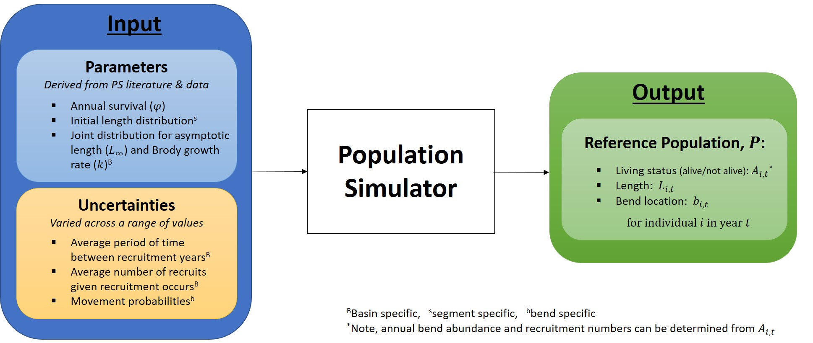

```{r, warning=FALSE, include=FALSE}
source("_R/1_global.R")
source("_R/2_functions.R")
source("_R/3_load-and-clean.R")
#source("_R/4_figures.R")
source("_R/5_tables.R")
```

<!--
rmarkdown::render("_Reference-Population.Rmd",output_format='html_document')# 
build page
-->


# Overview

<!-- IF WE NEED A MORE DETAILED INTRO WE CAN SAY SOMETHING LIKE: We used 
a Bayesian Decision Network (BDN) to evaluate alternative PSPAP 
monitoring designs (Marcot et al. 2001, Nyberg et al. 2006, Conroy and 
Peterson 2013). The development and parameterization of the BDN required 
two steps (see ??). The second step was to stochastically simulate the 
outcomes of the alternative monitoring designs. In short, the process 
that we used (and continue to use) to generate monitoring design 
outcomes involves four steps (see ??), the first of which is to simulate 
known reference pallid sturgeon populations. Therefore...pick up with 
what follows--> 

A set of reference populations of known pallid sturgeon abundance was 
needed to evaluate varying monitoring designs and their ability to 
achieve the fundamental objectives identified during the first 
population assessment program workshop (See Section ??). A reference 
population provides data on the annual survival and movement of each 
fish in the population (including new recruits) at the bend-level 
(Figure 1). Since fish length may influence sampling effectiveness (e.g. 
gear selectivity), data on individuals (e.g., growth) was also 
simulated. 


### Objectives

The objectives of this analysis were to:

1. Create a set of spatially explicit pallid sturgeon population with 
known bend-level annual abundances, 
2. Simulate reference population dynamics for 10 years with varying but 
known annual survival, individual growth, movement, and recruitment, and 
3. Allow movement and recruitment to vary over a wide range of 
biologically reasonable conditions in order to better understand their 
relationship with monitoring design outcomes. 

### Major Assumptions

1. Survival probability is homogeneous among all individuals and 
independent of space and time.
2. Individual fish growth follows a von Bertalanffy growth equation.
3. There is no movement within years.
4. Movement within a basin can occur between years.
5. Recruitment occurs at the basin-level and is stochastic.

Assumptions 1 and 2 are reasonable simplifications for the purposes of 
this evaluation and have been used in various fish studies (Cite Kirk, 
Holan & Wu, & Rotella). Assumptions 3 and 4 match the assumptions of 
many closed population estimators from mark-recapture estimation to 
robust design estimation. Making these assumptions allows for the 
evaluation of such estimators under the best possible movement 
conditions---if an estimator performs poorly under the best movement 
conditions, then its use in less favorable movement conditions is 
further questionable. However, since it is unclear how closely 
assumptions 3 and 4 are met in reality, we explore and discuss the 
consequences of breaking these movement assumptions on estimator outputs 
in Appendix ??. Lastly, since recruitment is expected to vary from year 
to year and fish are expected to migrate to spawning habitats within 
basin (and not necessarily stay in particular bends), assumption 5 is 
appropriate for studying pallid sturgeon. 


# Methods

### Spatial extent and grain

This analysis was constrained to generate reference pallid sturgeon 
populations for segments and bends within the upper basin (segments 1-4)
and lower basin (segments 7-10, 13 and 14) of the Missouri River. Bends 
of varying length were used to generate the spatial distribution of 
pallid sturgeon (Table 1).

### Population Initialization

The pallid sturgeon reference population was initialized using data from 
the PSPAP database and the pallid sturgeon literature. Population 
initialization required xx steps: 1. initializing bend-level abundance, 
2. initializing lengths and growth parameters of individuals within each 
bend, 3. assigning demographic rates (i.e., sex, origin). 

#### Bend Abundance

We populated each river bend with pallid sturgeon based on expected 
segment-level densities by origin (Table 2). The number of pallid 
sturgeon assigned to a bend was stochastically generated from a Poisson 
distribution given the segment density and bend length as: 

$$N_{segment,bend}\sim 
Poisson\left(\sum_{origin}\lambda_{segment,origin}\cdot 
l_{segment,bend}\right),\text{(1)}$$

where 
 
* $N$ is the number of pallid sturgeon within each bend,
* $\lambda$ is the segment and origin specific density in fish per RKM,
* $l$ is bend length in RKM,
* $segment$ indexes segment within universe,
* $bend$ indexes bend within segment, and
* $origin$ indexes whether pallid sturgeon were hatchery or natural 
origin. 

Generating bend abundances from a Poisson distribution allows for 
variation in bend densities among bends within segment while 
guaranteeing that the bend is populated with a whole number of fish. 
Additionally, one could derive a spatial Poisson distribution with the 
following assumptions: 

1. The probability of 1 pallid being in a column of water with length 
$dl$ and the width of the river at RKM $l$ is $\alpha$. 
2. The probability of 2 or more pallid sturgeon in a column of water 
with length $dl$ is negligible $o(\varepsilon)$. 
3. The number of pallid sturgeon in disjoint (non-overlapping) water 
columns $dl_1$ and $dl_2$ are independent. In other words the presence 
or absence of a fish in water column 1 does not effect the probability 
of a fish being present in water column 2, even if these two water 
columns are adjacent to each other. 


<!--WORKS BETTER WITH $dA$ BUT WE DON'T HAVE WIDTHS... COULD ASSUME AN 
APPROXIMATELY CONSTANT WIDTH AMONG BENDS WITHIN SEGMENT TO ACHIEVE THIS. 
MECNOTE-we can 
get widths-->


#### Assigning length and growth parameters to individuals

We randomly assigned an initial length to each individual fish. Initial 
lengths were generated from a segment specific distribution constructed 
from recent (2015-??) PSPAP database length data. Only pallid sturgeon 
data where both length and weight were reported as non-negative values 
were used. Additionally, data points that were residual outliers to the 
log-log regression of weight and length were excluded from the analysis. 
Lastly, only lengths greater than 200mm were included in the analysis. 
Lengths 200mm or less were considered to be from age-0 pallid sturgeon 
and these fish would instead be added to the reference population 
through an analysis of next year's recruitment (described in a later 
section below). 

 

The cleaned up data was then analyzed by segment. For each segment, a 
numerical inverse cummulative distribution function for length was 
generated by interpolating between the percentiles of the length data 
for the given segment. This was achieved using "approxfun" in R's stats 
package. Inverse cummulative distribution functions take a probability 
value between 0 and 1 as input and output a length value. Therefore, we 
were able to generate an individual's initial length by using a 
uniformly sampled probability value as input to the inverse cummulative 
distribution function associated with the individual's segment. 


Additionally, we assigned individual von Bertalanffy growth parameters 
$L_\infty$ and $k$, or the asymptotic length and Brody growth 
coefficient of a fish's growth trajectory, respectively, to each fish. 
Growth parameters were generated from a basin specific bivariate normal 
distribution fitted to the length data in the PSPAP database. (FURTHER 
DESCRIPTION HERE; NEED MIKE TO DO SINCE NOT SURE HOW DONE) <!--MECNOTE: 
on my todo list now--> 


To avoid unrealistic growth parameter values we truncated each bivariate 
normal distribution (one for each basin) to the middle 80%.  All points 
$(L_\infty, k)$ of the truncated distribution are contained on or within
an ellipse centered at $\mathbf{\mu}=(\mu_{L_\infty}, \mu_k)$, the basin
specific mean values for $L_\infty$ and $k$.  Since the R package 
$\texttt{tmvtnorm}$ truncates multivariate normal distributions to
rectangular regions, as opposed to elliptical regions, we used a 
different approach to randomly draw points from the desired elliptical
region.  

In short, we first drew points from the middle 80% of a standard 
bivariate normal distribution and then transformed these points to the
bivariate normal distribution of interest, giving us randomly drawn 
points that fall on or within the 80% ellipse.  The truncation process 
was achieved using $\texttt{rtruncnorm}$ twice in R, once for the normal
distribution associated with $L_\infty$ and then again for the normal 
distribution associated with $k$ conditional on $L_\infty$.  For more
details see Appendix ??.  


### Simulating Annual Transitions
After initializing the reference population, we track all individual 
fish for 10 years, recording individual survival status, bend location,
and length on a yearly basis.  Additionally, new recruits may be added 
to the population and tracked.  

#### Survival & Growth
Survival is stochastic but simulated with a survival probability that is 
homogeneous among individuals with all fish in the river having an equal 
probability, $\phi$, of surviving the year.  Survival probability is 
independent of individual age, length, sex, origin, location, and year. 
In other words, each year individual fish survival is a Bernoulli trial
with fixed probability of success, $\phi$. 

Annual growth is projected by individual von Bertalanffy growth curves 
as
 
$$ L(t+1)=L(t)+(L_\infty-L(t))(1-e^{-k}), \text{(2)}$$

where $L(t)$ is the individual's length during year $t$ and each fish 
has its own randomly generated asymptotic length, $L_\infty$, and Brody 
growth rate, $k$, as described in the previous section on initializing 
the population. 


#### Movement
Within basin movement occurs between years and is considered at the 
bend-level. Pallid sturgeon may move from one bend to another bend 
within the same segment, from one bend to another bend within a 
different segment (but same basin), or stay within the same bend. 
Movement probabilities are based on current bend locations with the 
probability of being in bend $j$ the following year increasing as the 
distance between the fish's current bend and bend $j$ decreases. In 
particular, 


$$\mathbb{P}\Big(B(t)=j \quad | \quad B(t-1)=i\Big)=\frac{e^{-\beta d(i, 
j)}}{\sum_k e^{-\beta d(i, k)}}, \qquad \text{(3)}$$ 


<!--
$$\mathbb{P}\Big(B(t)=j \quad | \quad  B(t-1)=i\Big)=\frac{f(i,j)}{\sum_k f(i,k)},$$
and 
$$\begin{cases} 
      1, & k=i \\
      e^{\beta_0-\beta_1 d(i, k)}, & k\neq i
   \end{cases},$$
-->
where $i$, $j$, and $k$ are particular bends, $B(t)$ is the individual's 
bend location in year $t$, $d(i, k)$ is the distance in river kilometers 
(RKM) from the center of bend $i$ to the center of bend $k$, and $\beta$ 
is a basin specific parameter[^3]. 

 Currently, we have simulated reference populations that do not move 
(individuals can always be found in the same bend from one sampling 
season to the next), as well as reference populations with very little 
between year movement ($\beta=1$; high site fidelity). This allows for 
an evaluation of whether there are any stark discontinuities in optimal 
monitoring decisions between the simplified case of no movement and the 
case of very little between year movement. Additionally, to account for 
the uncertain nature of movement probabilities, we plan to vary $\beta$ 
from simulation to simulation, allowing the analysis of populations that 
range in having high site fidelity to low site fidelity (Figure 2). 
Since (3) is discontinuous in terms of river kilometer, a similar 
bend-level conditional probability distribution that is derived from 
movement probabilities that are continuous in space is also being 
considered as a movement model. 


#### Recruitment

Each year recruitment was determined by two factors: (1) whether or not 
spawning that led to successful recruitment occurred and (2) given 
recruitment occurred, how many age-0 fish survived to age-1 (number of 
recruits). Recruitment years occurred with a fixed expected frequency 
(e.g. once every 3 years) and were determined each year as the result of 
a Bernoulli trial (e.g. probability of success 1/3). During years when 
recruitment occurred, the number of recruits is drawn from a basin 
specific Poisson distribution. Assuming that spawning results in a large 
number of free embryos and that survival to age-1 is rare, then a 
Poisson distribution mathematically provides a good approximation for 
the number of recruits. Furthermore, the use of a Poisson distribution 
aligns well with how actual recruit data may be analyzed (?), as well as 
with the set-up of the collaborative population model. 

 Each new recruit is tracked after being randomly assigned an age-0 
location within basin, an age-0 length of 200mm, and von Bertalanffy 
growth parameters. Age-0 bend locations are generated from a discrete 
uniform distribution that includes all bends within basin, while growth 
parameters are generated from the same basin specific truncated 
bivariate normal distribution used during the initialization of the 
population. Initial length was chosen as 200mm, because (REASON HERE). 
Despite fixed initial lengths, the growth trajectories of recruits will 
differ due to variation in their individual growth parameters. 


##### Page Break

# Figures

```{r,echo=FALSE}

```


##### Page Break

```{r,echo=FALSE}
knitr::include_graphics("images/Movement.jpeg")
```

##### Page Break

# Tables


Table 1. Summary of bends within PSPAP Missouri river segments.
 
```{r,echo=FALSE}
tbl<-tables(1)
tbl$basin<- ifelse(tbl$basin=="lower","LB","UB")
tbl$b_segment<-as.numeric(tbl$b_segment)
tbl<- tbl[order(tbl$b_segment),]
tbl[duplicated(tbl$basin),]$basin<-""
kable(tbl,row.names=FALSE,
    col.names=c("Basin","Segment","Number of bends",
        "Minimum length (km)", "Mean length (km)","Maximum length (km)"),
    align="lccccc")
```

##### Page Break

Table 2. Segment and river level densities by origin: hatchery (H) and 
natural/wild (W).  Minimum and maximum densities were taken from data 
across a few recent years (when available), while mean densities are 
those reported in the literature from the most recent year's data.   

```{r,warning=FALSE, echo=FALSE}
tbl2<-tables(2)
tbl2$max_year[which(tbl2$max_year==2008)]<-"2008*"
tbl2$rpma<-ifelse(tbl2$rpma==2, "UB", "LB")
tbl2[duplicated(tbl2$rpma),]$rpma<-""
tbl2[duplicated(tbl2$segments),]$segments<-""
kable(tbl2,row.names=FALSE,
    col.names=c("Basin","Segments", "Fish Type", "Minimum Density (fish/rkm)",
                "Maximum Density (fish/rkm)", "Mean Density (fish/rkm)", 
                "Most Recent Year", "References"),
    align="llcccccc")
```
  
*Estimated year of data collection based on reference date.    

##### Page Break
# Code

Box 1. Function used to simulate reference populations given pallid 
sturgeon density, survival, and spatial structure. 


```{r,echo=FALSE}
print(reference_population)
```

