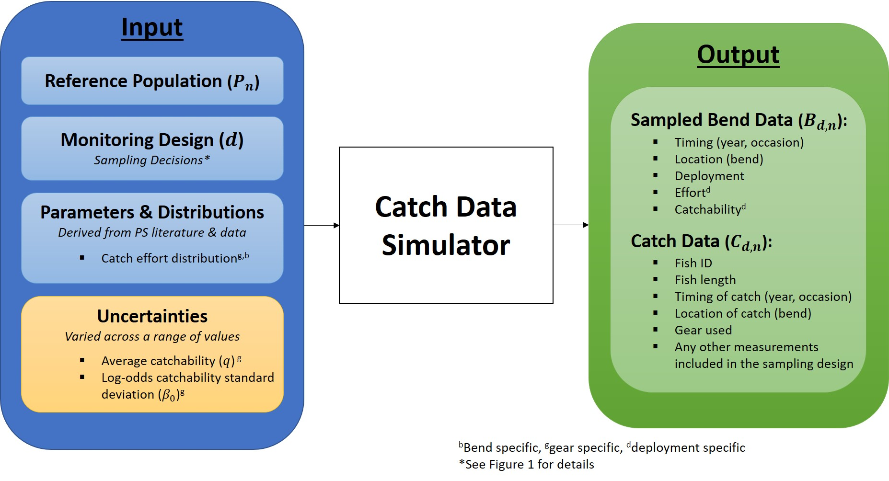

<!--
https://rpubs.com/ajlyons/autonumfigs
rmarkdown::render("_reboot-master-report.Rmd",
    output_format="word_document",
    output_file = paste(format(Sys.time(), '%Y%m%d%H%M'),
        "reboot-master-report.docx",sep="-"))# build page
-->


```{r, warning=FALSE, include=FALSE}
source("_R/1_global.R")
source("_R/2_functions.R")
effort_data<-FALSE   # NEEDED TO CREATE TABLE 2... COMMENT THIS & TABLE 2 OUT TO SAVE TIME
source("_R/3_load-and-clean.R")
#source("_R/4_figures.R")
source("_R/5_tables.R")
```

```{r child="_Report-1-01-introduction.Rmd", echo=FALSE}
```

<!--Executive summary-->


# Introduction


# Methods

<!--Methodological overview: a couple of paragraphs overviewing 
the process-->

```{r child="_methods-overview.Rmd", echo=FALSE}
```

<!-- Methods: Eliciting stakeholder objectives-->
```{r child="_objectives-hierarchy.Rmd", echo=FALSE}
```

<!--Methods: reference population-->
```{r child="_Reference-Population.Rmd", echo=FALSE}
```

```{r child="_Catch-Data.Rmd", echo=FALSE}
```
<!--Methods: decisions and decision space-->


<!--Methods: valuing design outcomes-utilities-->
```{r child="_utilities.Rmd", echo=FALSE}
```


<!--Methods: valuing design outcomes-utilities-->
```{r child="_appendix-code.Rmd",echo=FALSE,eval=FALSE}
print("# Appendix 1. Code")
```

##### page break

# Figures

```{r,echo=FALSE}
knitr::include_graphics("images/monitoring-framework.png")
```

Figure 1. Monitoring framework illustrating the 4 components.


##### Page Break


```{r,echo=FALSE}
knitr::include_graphics("images/PopSim.jpg")
```
Figure 2. Population simulation

##### Page Break

```{r,echo=FALSE}
knitr::include_graphics("images/Movement.jpeg")
```
Figure 3. Movement illustration.

##### Page Break

```{r,echo=FALSE}
knitr::include_graphics("images/MonitoringDesign.jpg")
```

Figure 4. 

##### page break

```{r,echo=FALSE}

```

Figure 5.

##### page break

```{r,echo=FALSE}
knitr::include_graphics("images/EffortDistEx.jpeg")
```

Figure 6. 

##### page break


```{r,echo=FALSE,warning=FALSE, message=FALSE}
source("_R/6-analysis-cost.R")


fit<-lm(lperdep~year+fieldoffice+year:fieldoffice,
    depcost)
fit<-lm(lperdep~fieldoffice,
    depcost)
depcost$ldepcosthat<- predict(fit,depcost)  
  
    

hist(depcost[depcost$fieldoffice=="NE",]$perdep)
hist(depcost[depcost$fieldoffice=="CF",]$perdep)

plot(lperdep~year,depcost,type='n')
 fo<-unique(depcost$fieldoffice)
for(i in 1:length(fo))
    {
    points(lperdep~year,depcost,
        subset=fieldoffice==fo[i],
        type='l',
        col=i,
        lwd=2)
    }

    
plot(resid(fit)~fitted(fit))
plot(lperdep~ldepcosthat,depcost)    
plot(perdep~year,depcost,
    subset=fieldoffice=="SD")
    
plot(perdep~year,depcost,
    subset=fieldoffice=="MT")
    
plot(perdep~year,depcost,
    subset=fieldoffice=="CF")  
```

Figure 7.


```{r,echo=FALSE,fig.align='center'}
pbias<- c(-300:300)
pbias_u<- (max(abs(pbias))-abs(pbias))/(max(abs(pbias))-min(abs(pbias)))
u_bias<- approxfun(pbias,pbias_u)
plot(pbias_u~pbias,type='l',xlab="Proportional bias",
    ylab="Scaled proportional bias",las=1)
```
Figure 8. 

```{r,echo=FALSE,fig.align='center'}
pbias<- c(10:300)
pbias_u<- (max(pbias)-pbias)/(max(pbias)-min(pbias))
u_cv<- approxfun(pbias,pbias_u)
plot(pbias_u~pbias,type='l',xlab="Scaled coefficient of variation",
    ylab="Scaled coefficient of variation",las=1)
```

Figure 9.


```{r,echo=FALSE,fig.align='center'}
pbias<- c(30:100)
pbias_u<- (pbias-min(pbias))/(max(pbias)-min(pbias))
u_perf<- approxfun(pbias,pbias_u)
plot(pbias_u~pbias,type='l',xlab="Performance",
    ylab="Scaled performance",las=1)
```

Figure 10. In the plot above, values with lower performance values have lower 
values and increasing values approach 1. 


Figure 10.

Figure 8. 
# Tables


Table 1. Summary of bends within PSPAP Missouri river segments.
 
```{r,echo=FALSE}
tbl<-tables(1)
tbl$basin<- ifelse(tbl$basin=="lower","LB","UB")
tbl$b_segment<-as.numeric(tbl$b_segment)
tbl<- tbl[order(tbl$b_segment),]
tbl[duplicated(tbl$basin),]$basin<-""
kable(tbl,row.names=FALSE,
    col.names=c("Basin","Segment","Number of bends",
        "Minimum length (km)", "Mean length (km)","Maximum length (km)"),
    align="lccccc")
```

##### Page Break

Table 2. Segment and river level densities by origin: hatchery (H) and 
natural/wild (W).  Minimum and maximum densities were taken from data 
across a few recent years (when available), while mean densities are 
those reported in the literature from the most recent year's data.   

```{r,warning=FALSE, echo=FALSE}
tbl2<-tables(2)
tbl2$max_year[which(tbl2$max_year==2008)]<-"2008*"
tbl2$rpma<-ifelse(tbl2$rpma==2, "UB", "LB")
tbl2[duplicated(tbl2$rpma),]$rpma<-""
tbl2[duplicated(tbl2$segments),]$segments<-""
kable(tbl2,row.names=FALSE,
    col.names=c("Basin","Segments", "Fish Type", "Minimum Density (fish/rkm)",
                "Maximum Density (fish/rkm)", "Mean Density (fish/rkm)", 
                "Most Recent Year", "References"),
    align="llcccccc")
```
  
*Estimated year of data collection based on reference date.    


##### page break


Table 3. Number of Bends Sampled per Segment
```{r, echo=FALSE}
no_bends<-data.frame(Segment=c(2:4,7:10,13,14), 
    No_Bends=c(12, 21, 12, 12, 15, 20, 10, 11, 14))
kable(no_bends, row.names=FALSE, 
      col.names=c("Segment", "No. of Sampled Bends"))
```

##### page break

Table 4. Summary of effort data by gear and basin, where effort is 
measured in minutes. The shape and rate columns are the results of 
fitting a gamma distribution to the data. 


```{r,warning=FALSE,echo=FALSE}
#tbl<-tables_effort(n=4, dat=dat)
#write.csv(tbl,"_output/effortAndGearSummary.csv",row.names=FALSE)
tbl<-read.csv("_output/effortAndGearSummary.csv") 
kable(tbl,row.names=FALSE,
    col.names=c("Basin","Gear","Gear ID", "No. of Observations", 
        "Mean Effort",
        "SD of Effort", "Minimum Effort", "Maximum Effort", 
        "Median Effort","Shape", "Rate"),
    align="lccccc")
```

Table X.1. Field office affiliations and Missouri River segments
assigned for PSPAP sampling.

| Field office                             	| Segment          	|
|------------------------------------------	|------------------	|
| Montana Fish Wildlife and Parks (MT)     	| 1, 2, 3          	|
| Missouri River FWCO (MR)                 	| 4                	|
| Great Plains FWCO (GP)                   	| 5, 6             	|
| South Dakota Game Fish and Parks (SD)    	| 7                	|
| Nebraska Game and Parks Commission (NE)  	| 8, 1/2 of 9      	|
| Missouri Department of Conservation (MO) 	| 1/2 of 9, 10, 11 	|
| Columbia FWCO (CF)                       	| 13, 14           	|


Table X.2.  

```{r,echo=FALSE,as.is=TRUE}
knitr::kable(tmp,
    row.names=FALSE,
    col.names=c("Field crew", "Mean cost","Median cost", "Std. deviation",
        "Minimum cost","Maximum cost"),align=c("lccccc"),
    digits=2)
```


Box 1. Function used to simulate reference populations given pallid 
sturgeon density, survival, and spatial structure. 


```{r,echo=FALSE}
print(reference_population)
```


##### page break


Box 1. Function used to simulate which bends are sampled each year given 
a sampling strategy. 

```{r,echo=FALSE}
print(bend_samples)
```

##### page break

Box 2. Function used to simulate the catch data given a sampling 
strategy. Note, this function calls the function "bend_samples", which 
is the function defined in Box 1. 


```{r,echo=FALSE}
print(catch_data)
```


# References


<!--
# Discussion
  * Virtual versus power analysis of a post-hoc glm to get trend

How did wildhaber and adam do it did they do virtual or just trend.

They did essentially the same thing, evaluating what the change in cpue
was rather than actually doing trend. In other words what is the power to 
detect a 10% decrease in the mean where mean cpue was estimated for each 
year but not as a function of year.
-->