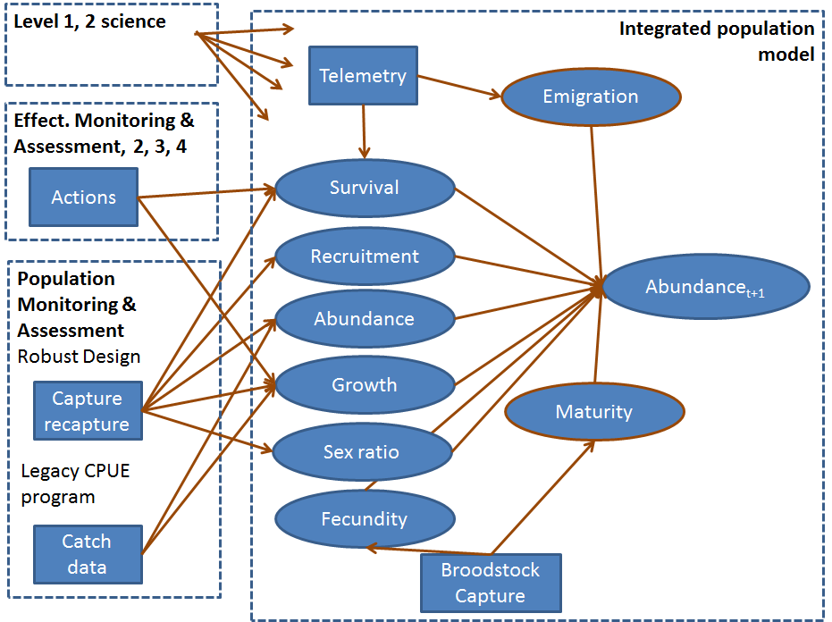
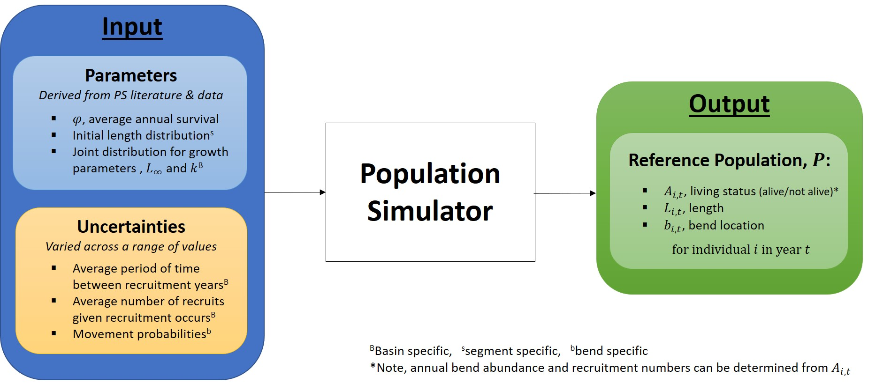
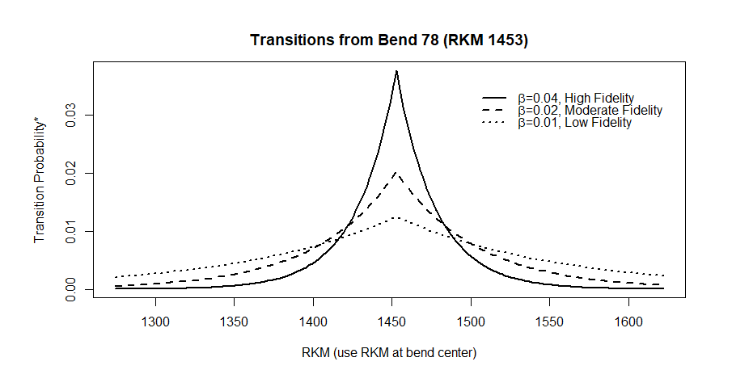
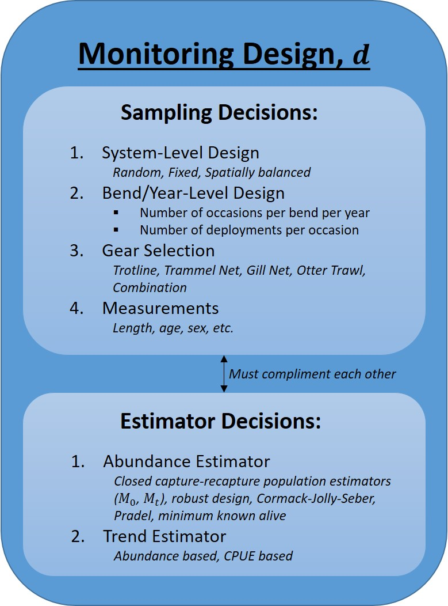
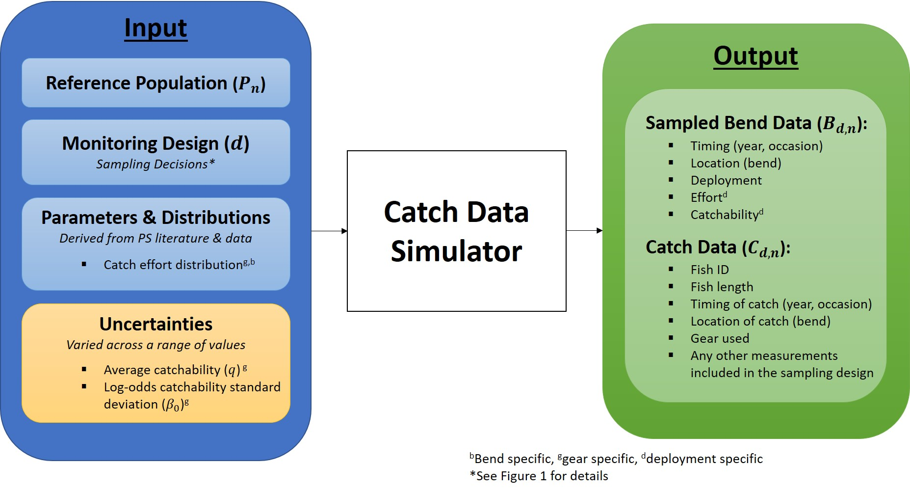
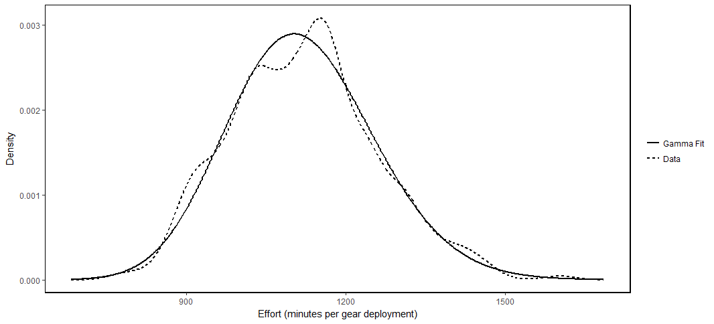
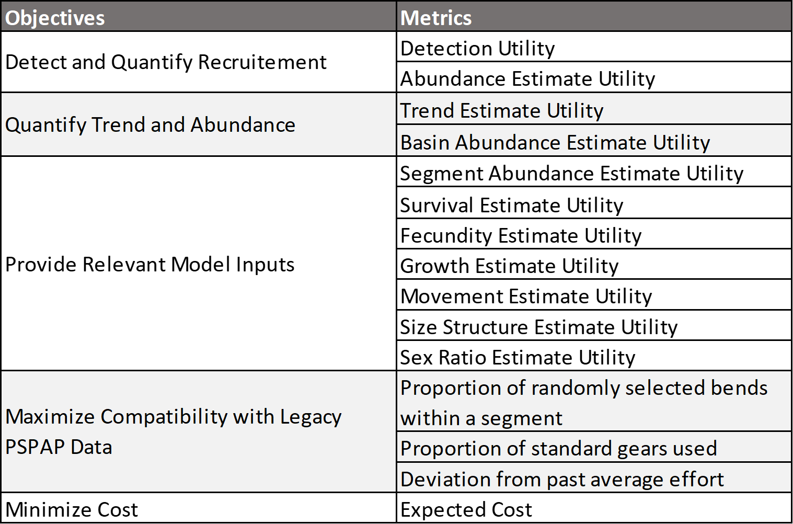

<!--
rmarkdown::render("_Report-5-01-figures",output_format='html_document')# build page
-->

```{r, warning=FALSE, include=FALSE}
source("_R/1_global.R")
source("_R/3_load-and-clean.R")
source("_R/4_figures.R")
```


```{r,echo=FALSE}

```

Figure 1. Monitoring framework illustrating the 4 components.


##### Page Break


```{r,echo=FALSE}

```
Figure 2. Population simulation

##### Page Break

```{r,echo=FALSE}

```
Figure 3. Movement illustration.

##### Page Break

```{r,echo=FALSE}

```

Figure 4. 

##### page break

```{r,echo=FALSE}

```

Figure 5.

##### page break

```{r,echo=FALSE}

```

Figure 6. 

##### page break


```{r,echo=FALSE,warning=FALSE, message=FALSE,eval=TRUE}
source("_R/6-analysis-cost.R")
fit<-lm(lperdep~year+fieldoffice+year:fieldoffice,
    depcost)
fit<-lm(lperdep~fieldoffice,
    depcost)
depcost$ldepcosthat<- predict(fit,depcost)  
hist(depcost[depcost$fieldoffice=="NE",]$perdep)
hist(depcost[depcost$fieldoffice=="CF",]$perdep)

plot(lperdep~year,depcost,type='n')
 fo<-unique(depcost$fieldoffice)
for(i in 1:length(fo))
    {
    points(lperdep~year,depcost,
        subset=fieldoffice==fo[i],
        type='l',
        col=i,
        lwd=2)
    }

    
plot(resid(fit)~fitted(fit))
plot(lperdep~ldepcosthat,depcost)    
plot(perdep~year,depcost,
    subset=fieldoffice=="SD")
    
plot(perdep~year,depcost,
    subset=fieldoffice=="MT")
    
plot(perdep~year,depcost,
    subset=fieldoffice=="CF")  
```

Figure 7.


```{r,echo=FALSE, eval=TRUE}
pbias<- c(-300:300)
pbias_u<- (max(abs(pbias))-abs(pbias))/(max(abs(pbias))-min(abs(pbias)))
u_bias<- approxfun(pbias,pbias_u)
plot(pbias_u~pbias,type='l',xlab="Proportional bias",
    ylab="Scaled proportional bias",las=1)
```
Figure 8. 

```{r,echo=FALSE,eval=FALSE}
pbias<- c(10:300)
pbias_u<- (max(pbias)-pbias)/(max(pbias)-min(pbias))
u_cv<- approxfun(pbias,pbias_u)
plot(pbias_u~pbias,type='l',xlab="Scaled coefficient of variation",
    ylab="Scaled coefficient of variation",las=1)
```

Figure 9.


```{r,echo=FALSE,eval=FALSE}
pbias<- c(30:100)
pbias_u<- (pbias-min(pbias))/(max(pbias)-min(pbias))
u_perf<- approxfun(pbias,pbias_u)
plot(pbias_u~pbias,type='l',xlab="Performance",
    ylab="Scaled performance",las=1)
```

Figure 10. In the plot above, values with lower performance values have lower 
values and increasing values approach 1. 

Figure ??
```{r,echo=FALSE}

```


## Effort Figures
```{r,echo=FALSE,eval=FALSE}
#datUBgear causing issues
figures_effort(1, dat=effort)
```

Figure 1. Illustration of gears used since 2003 for Pallid Sturgeon 
Population assessment in the Missouri River. Top panel is for Lower 
basin (RPMA 4) and bottom panel is for Upper basin (RPMA 2). 


