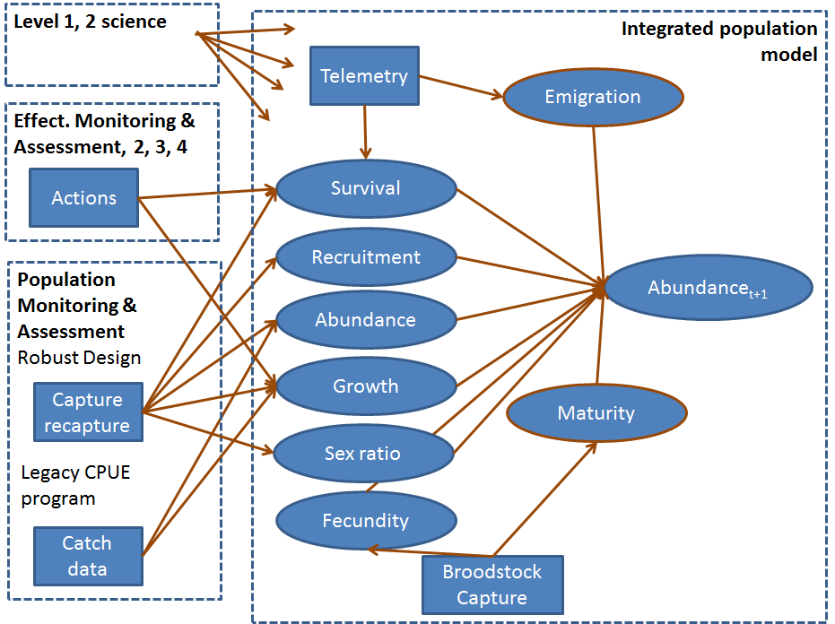

<!--
rmarkdown::render("_reboot-master-report.Rmd",
    output_format="word_document",
    output_file = paste(format(Sys.time(), '%Y%m%d'),"reboot-master-report.docx",sep="-"))# build page

    
* added content from submitted white paper to ISAP

To do:
1. fix references to link to bibtex
2. fix equations imported from word
-->

# Evaluation context for the PSPAP V. 2.0
Redesign of the Pallid Sturgeon Population Assessment Program (PSPAP) to 
PSPAP v. 2.0 is intended to update population assessment to support 
adaptive management of the Missouri River Recovery Program (MRRP). PSPAP 
v. 2.0 is considered to be a necessary part of the pallid sturgeon 
monitoring strategy, but it is not considered to be sufficient for 
monitoring needs. Instead, it is designed to be complementary to three 
other components: effectiveness monitoring, focused research studies, 
and the collaborative population model. These four components define the 
information framework needed to understand and predict population 
responses to management action (fig. 1). 

1. Pallid Sturgeon Population Assessment Program v. 2.0. The fundamental 
objective of PSPAP v. 2.0 is to provide essential population-level 
information needed for the MRRP to make decisions about its fundamental 
objectives, including, but not limited to: 
    1. Discern status and trends of the pallid sturgeon population; serve 
    as validation of model predictions. 
    1. Complement and enhance understanding of linkages from management 
    actions to population responses. PSPAP v. 2.0 cannot provide direct 
    linkages to all management actions but will be especially important in 
    evaluating population responses to augmentation and stocking decisions. 
1. Effectiveness monitoring. 
Each MRRP action has an associated monitoring plan that is designed to 
provide insights into whether the action has the intended ecological 
effect. These are presently being defined for flow cues, passage around 
Intake Dam, spawning habitat, interception-rearing complexes (IRCs), and 
rehabilitation of shallow-water habitat projects. These effectiveness 
monitoring plans focus on the implementation monitoring (i.e., was the 
management action implemented as intended?) and process-based monitoring 
(i.e., did the management action achieve desired changes to ecological 
processes thought to lead to increased growth and survival?). They do 
not address population-level responses to the actions directly. Instead, 
they provide information complementary to PSPAP v2.0, the Collaborative 
Population Model, and focused research studies, which will be needed to 
link the management actions to the population-level effect. An overview 
of the effectiveness monitoring approach for each of the MRRP actions, 
with IRCs presented as a more detailed example, is provided in a 
companion white paper. 
2. Focused research studies. The level 1 and level 2 focused research 
studies described in appendix C of the Missouri River Science and 
Adaptive Management Plan (MRSAMP) are designed to provide fundamental 
understanding of pallid sturgeon ecology in the Missouri River and to 
develop quantitative response models. For example, level 1 mesocosm 
studies on foraging bioenergetics of age-0 sturgeon are meant to 
translate changes in habitat characteristics in IRCs (depths, 
velocities, and bottom conditions) into changes in growth and survival. 
Other level 1 studies are intended to develop technologies that can be 
used to measure responses, such as improvements in telemetry systems and 
direct measurements of habitat conditions and egg survival. 
1. Collaborative Population Model. The Collaborative Population Model 
documented in Jacobson and others (2016) serves as the framework to 
integrate understanding from effectiveness monitoring, focused research, 
and PSPAP v. 2.0. Changes in model parameters values associated with 
actions (for example, increases in age-0 survival associated with IRCs 
or increases in viable gametes associated with flow cues or spawning 
habitats) will be incorporated into the model to provide predictive 
understanding (and uncertainties) of population-level responses 
associated with management action. PSPAP v. 2.0 may provide additional 
parameter estimates (for example gender ratios, fecundity, age at first 
reproduction, and recrudescent intervals). Importantly, PSPAP v. 2.0 
will provide the empirical data on population status and trends needed 
to validate population model results. 

The remainder of this paper focuses on the design process elements for 
PSPAP v. 2.0. It should be noted that this redesign process and possible 
changes affect many stakeholders. Stakeholders include state and federal 
agencies, agencies contracted to collect data, consulting groups working 
on the adaptive management plan, and the USACE which provides the 
resources to conduct the assessment. Therefore we are using a structured 
decision making process to provide a transparent and rigorous approach 
to evaluate alternative monitoring designs in the context of stakeholder 
objectives and accounting for uncertainty (Conroy and Peterson 2013). 
This process began in March 2017 and is expected to extend through early 
spring 2019, according to this schedule: 

* March 21, 2017: Workshop developing objective hierarchy and elicit 
logistical sampling information from stakeholders 
* Spring 2017 – Fall 2017: Model sampling scenarios – explore approaches 
to meeting objectives, mix of methods, benefit:cost of objectives. 
Communicate progress through PSPAP v. 2.0 blog. 
* August 31, 2017: Webinar to document progress, elicit additional 
information on objectives hierarchy and sampling logistics. 
* October 2017: Complete white paper for ISAP review.
* Late Fall 2017: Meeting to present design results to agencies, stakeholders.
* December 2017: Deliver draft PSPAP v. 2.0 sample-design report. 
* Winter 2017-2018: Agency review, ISAP review, and revisions
* Spring 2018: Implement the design on a pilot basis.
* Spring – Fall 2018: Revise, refine models and protocol. Finalize 
design report. 
* Spring 2019: Implement PSPAP v. 2.0.


# Background of PSPAP v. 2.0 Design

The need to redesign the PSPAP was triggered by the recognition that the 
current PSPAP may not allow evaluation of whether pallid sturgeon 
fundamental objectives identified in the AM plan were achieved on an 
annual basis or estimated with any level of certainty. Specifically, 
sub-objectives listed in section 4.1.1. of the AM plan specify 1) 
increase pallid sturgeon recruitment to age-1, and 2) maintain or 
increase numbers of pallid sturgeon as an interim measure until 
sufficient and sustained natural recruitment occurs, both of which are 
needed to achieve the fundamental objective set by the USFWS to preclude 
species jeopardy. These two sub-objectives are redefined as fundamental 
objectives in the context of the monitoring program to quantify 
recruitment to age-1 and quantify pallid sturgeon population trend and 
abundance. 

The first sub-objective (increase pallid sturgeon recruitment to age-1) 
is based on the understanding that bottlenecks for pallid sturgeon 
populations are likely in age-0 survival and that after the first year 
of life, survival increases substantially (DeLonay et al. 2016). Metrics 
to assess achievement of this objective are particularly challenging 
because of the rarity of the species and existing technical difficulties 
with capturing age-1 (and age-2, age-3) fish and in accurately 
determining ages. As direct assessment of recruitment to age-1 is 
unlikely to be successful, the PSPAP v. 2.0 process has proceeded with 
the assumption that recruitment will need to be assessed through 
estimates of abundance and trend of older fish, determination of 
hatchery or wild origin, and back-calculation of age-1 recruitment rates 
through a well-calibrated and validated population model. Success of the 
second sub-objective (maintain or increase numbers of pallid sturgeon as 
an interim measure) can be assessed through direct empirical abundance 
and trend data, but the assessment can be enhanced, and better linked to 
management actions, through incorporation of monitoring data into the 
collaborative population model. 


# Redesign objectives
The objective of the redesign effort is to identify sampling designs and 
abundance and trend estimators that will give optimal estimates given 
budget constraints. Our approach is to compare metrics of estimator 
success and associated sampling costs across multiple estimators and 
sampling strategies, while accounting for uncertainties about whether 
monitoring program objectives were achieved. 

The following sections outline the approach used for this comparison. 
The methods described below are overviews intended to provide sufficient 
understanding of the process but not overwhelm the document with 
technical details. It should also be noted that evaluating alternative 
monitoring designs is not trivial, and at times requires days of 
computing time to run estimators and various simulations with sufficient 
numbers of replications to fully characterize the potential outcomes. 


# PSPAP stakeholders and eliciting monitoring objectives 
Many state and federal agencies contracted to collect pallid sturgeon 
population assessment data will be affected by changes to the current 
PSPAP design, as well as consulting groups and management agencies 
dependent on monitoring data to inform adaptive management. We convened 
a face-to-face stakeholder workshop during the MRNRC meeting in March 
2017 to present an overview of the redesign process and to elicit 
stakeholder[^1] objectives for the program. Five fundamental information 
objectives of the PSPAP were identified at the workshop: 1) quantify 
recruitment to age-1, 2) quantify population trend and abundance, 3) 
provide collaborative population model inputs (improved parameter 
estimates), 4) maintain compatibility with legacy PSPAP data, and 5) 
remain within cost constraints. Stakeholders identified many means 
objectives that potentially contribute to the fundamental objectives; 
they also provided critical information on logistics of sampling. Means 
objectives included varying population metrics to monitor and approaches 
needed to quantify the metrics. Metrics identified during the objectives 
elicitation were organized to 8 categories. Specifically, stakeholders 
identified metrics relating to population structure (e.g., age and size 
structure, sex ratio), reproductive status (e.g., fecundity, 
reproductive cycling, size at sexual maturity), health status (e.g., 
stress, condition, diet, contaminants), population augmentation, 
movement (i.e., spawning, seasonal), demographic rates (e.g., 
recruitment, survival), fish community (e.g., competition, invasive 
species), and genetic status (e.g., effective population size, 
hybridization, local adaptation). Stakeholder objectives were organized 
in an influence diagram during the workshop. The influence diagram 
serves 2 purposes. First, it clarifies stakeholders' fundamental and 
means objectives, thereby increasing transparency. Second, the influence 
diagram can be developed into a Bayesian Decision Network (BDN) to 
evaluate alternative PSPAP designs (Marcot et al. 2001, Nyberg et al. 
2006, Conroy and Peterson 2013). The development and parameterization of 
the BDN required 2 steps: 1) translate nodes in the influence diagram to 
quantifiable metrics that can be estimated from a monitoring program and 
2) stochastically simulate the range of possible outcomes for a node, 
conditional on influencing nodes. This work is continuing and the 
methods below provide a limited overview of the process. 

[^1]: PSPAP stakeholders are differentiated from MRRP stakeholders. PSPAP stakeholders are agencies, institutions, or individuals that have been actively involved in pallid sturgeon population assessments, or that regularly use the data from population assessments. MRRP stakeholders are groups with a stake in management of the Missouri River as represented on MRRIC.


## 1) Translate nodes in influence diagram to quantifiable metrics 
The influence diagram was modified to develop a BDN. Specifically, nodes 
in the influence diagram were classified as nature, decision, or utility 
nodes. Nature nodes represent quantifiable metrics and the range of 
possible outcomes quantified as probabilities. For example, it is 
uncertain what level of recruitment might occur in the system, which in 
turn may influence the optimal monitoring design. Therefore recruitment 
uncertainty can be included by including a range of plausible 
recruitment levels and frequencies. Additionally, other important 
variables were added to the BDN – although not identified during the 
objectives elicitation – if they were considered to influence whether or 
not the objectives could be achieved. For example, catch depends on 
gear-specific catchability which is uncertain but can be bounded to 
reasonable levels from estimates of capture probability. 

The fundamental objectives were developed as utility functions that 
value the outcome of a monitoring design. For example, the fundamental 
objective to quantify population abundance and trend was quantified by 
calculating the bias, precision, and performance of alternative PSPAP 
designs. The bias of an estimator used with a particular sampling design 
is computed as the expected value of the difference between the 
estimated value and the actual value, where the expectation is taken 
over all estimates made by the given estimator on all catch data 
simulated under the given sampling design. Actual values can be treated 
as knowns since they are reported in or can be derived from a simulated 
reference population (described below). Precision is calculated as the 
expected ratio of the standard error to the absolute value of the 
estimate (more precise estimators have lower values of precision). Since 
some catch data (e.g., sparse data) will lead to errors in certain 
abundance estimator calculations (e.g., non-convergence), a measure of 
estimator performance also was calculated as the expected proportion of 
catch data that allows for reliable bend-level abundance estimates. Each 
estimator-sampling design combination is therefore associated with a 
measure of bias, precision, and performance. For each of the three 
metrics, we computed utilities as values in a common range: 0-1, with 
values scoring the closest to 1 giving the highest utility (i.e., 
proportional scoring Conroy and Peterson (2013)). The overall utility of 
the estimator-sampling design pair is evaluated as the weighted sum of 
these three utilities, where the weights are determined by the 
importance of each metric as established by stakeholders. Similarly, the 
overall utility of a suite of estimators (one abundance estimator, one 
trend estimator, etc.) for the same sampling design is the weighted mean 
of the utilities for each estimator. For example, if stakeholders decide 
that abundance and trend estimates are equally important, then the 
utility, U, of a particular sampling-estimation design would be 
calculated as U=0.5*U_abund+0.5*U_trnd, where U_abund and U_trnd are the 
utilities of the chosen abundance estimator and the chosen trend 
estimator under the particular sampling design, respectively. These are 
standard approaches for valuing outcomes and relating to stakeholder 
objectives (Clemen et al. 2001, Conroy and Peterson 2013). 

Additional valuation will be provided for the remaining fundamental 
objectives. Specifically, compatibility with legacy data will be 
quantified as the similarity in bend randomization among designs, 
provided collaborative population model inputs will be quantified as the 
proportion of model inputs estimated by design. Lastly, the cost for 
each sampling design will be evaluated taking several factors into 
account. While overhead costs are similar for all sampling designs, 
costs will vary among sampling designs with the number of sampling 
occasions within a year, the number of deployments per sampling 
occasion, sampling effort of each deployment, which gears are used, how 
much training is required for a particular gear, etc. Costs may also 
vary with estimators or what population characteristics are estimated 
(gender, age, fecundity, etc), especially if there is a need to purchase 
advanced equipment or hire staff with a particular set of advanced 
skills. For example, if an estimate requires samples to be sent out for 
something like blood-hormone analysis there would be an additional cost 
to the collection of the samples. Additionally, if the cost of any 
sampling-estimation design is greater than that allotted for in the 
budget, then its utility becomes zero since it would not be monetarily 
feasible to implement such a design. 

Potential sampling actions were collected into decision nodes. The 
decision nodes represent 4 classes of decisions: system-level sampling 
design, estimator, gear combinations, and measurements taken on 
individual fish. Alternative system-level sampling designs identified 
during the workshop and with follow-up stakeholder input are: 1) 
randomized selections of bends within the segment, 2) randomly selected 
bends within a segment initially and followed over time, and 3) a 
spatially balanced design (Stevens and Olsen 2004). Several estimators 
were identified that could potentially be used to achieve PSPAP 
fundamental objectives including catch-effort and capture-recapture 
estimators (e.g., robust design, Cormack-Jolly-Seber, Pradel, closed 
population estimators). Gears and gear combinations to evaluate were 
elicited from stakeholders and experts in the system. Lastly, the 
actions required to measure metrics of interest (e.g., stress, 
condition) were identified. 

## 2) Simulate the likely outcomes for a node, conditional on influencing nodes 

Simulation has been used (and is continuing) to generate the outcomes of 
the alternative monitoring designs. In short, this approach has four 
steps: simulate a known reference pallid sturgeon population, simulate 
sampling catch data from the reference population, estimate metrics from 
the catch data, and compare the estimates to the “true” values used to 
generate the reference population. 

### 1. Simulate a reference PS population
The pallid sturgeon reference population is initialized using data from 
the PSPAP database and the pallid sturgeon literature. Each river bend 
is populated with pallid sturgeon based on expected segment[^2]-level 
densities, while each fish is assigned an initial length and von 
Bertalanffy growth parameters L_inf and k from segment-level and basin 
-level distributions, respectively. Individual fish are then tracked for 
10 years, recording individual survival status, bend location, and 
length on a yearly basis. Survival is binomially distributed with fixed 
parameter f, and growth is projected by individualized von Bertalanffy 
growth curves. Within-basin movement is based on a pallid sturgeon’s 
current bend location with the probability of being in a particular bend 
the following year increasing as distance to that bend decreases. 
Immigration and emigration (for example, to/from the Mississippi River) 
are critical unknowns that can also be evaluated within the reference 
population. Recruitment occurs randomly with a fixed expected frequency 
(e.g., every year, every 3 years), and the number of recruits, given 
there is recruitment, is drawn from a basin-dependent Poisson 
distribution. Each new recruit is tracked after being randomly assigned 
an age-0 location within basin, an age-0 length of 200 mm, and von 
Bertalanffy growth parameters. The population simulation here is 
generalized from the collaborative pallid sturgeon population model 
(Jacobson et al, 2016). 

[^2]: Basin refers to the upper basin mainstem rivers (Upper Missouri River and Yellowstone River) and lower basin mainstem rivers (Lower Missouri River downstream from Gavins Point Dam, potential tributaries, and the Middle Mississippi River to an unspecified extent downstream from the confluence with the Missouri River).

### 2. Simulate sampling catch data
For each of the simulated reference populations, various sampling 
designs can be implemented to obtain simulated catch data. All sampling 
designs include segments 2-4, 7-10, 13, and 14, and at a minimum, the 
number of bends sampled within a segment matches those listed in Table 
A1 of Welker et al. (2016). The way bends are chosen, however, may vary. 
In a random sampling design bends within a segment are chosen each year 
randomly, while in a fixed sampling design they are chosen randomly once 
and then fixed to be sampled each of the following years. A combination 
of fixed and random designs can also be implemented, and a spatially 
balanced design is being considered. Sampling strategies can also differ 
in the number of sampling occasions (times within a year that each bend 
is sampled), as well as the number of gear deployments within a 
particular occasion. Additionally, each sampling design can be 
implemented with varying gears: gill nets, trammel nets, otter trawls, 
trotlines, or a combination of these. The catch is simulated from 
gear-specific catchability values which were bounded to produce 
plausible overall capture probabilities where catchability is defined as 
the probability of capture 1 fish per unit effort (Hubert and Fabrizio 
2007). 

### 3. Estimate metrics from the catch data
Once a sampling design is selected, 10 years of occasion-level catch 
data are simulated for each of the selected bends. Each fish within a 
selected bend has a probability, P, of being captured. This 
occasion-level capture probability varies from occasion to occasion, as 
it is calculated from the individualized deployment catchability and 
effort values. For each deployment, effort values f are drawn from a 
gear- and basin-specific gamma distribution, which was fit to PSPAP 
effort data. Deployment catchability q, or the probability of catching a 
single fish with one unit of effort, is drawn from a gear-specific 
distribution. Deployment-specific capture probabilities, p, are 
calculated as p=q*f and then aggregated to the occasion level to obtain 
P. When a fish is successfully caught, fish id, location (bend), timing 
(occasion within year) of catch, gear used, and other important 
individual attributes (e.g., length, weight, sex) are recorded, 
simulating a complete capture history at the bend level for the given 
sampling design. 

### 4. Compare the estimates to the “true” values
Several catch data simulations are being evaluated per reference 
population. All estimators are applied to each of the catch data 
simulations except where sampling design limits the use of an estimator, 
forcing the application of a smaller subset. Abundance estimates are 
first computed on the bend-level using various estimators: closed 
population M_0 and M_t (Otis et al. 1978), Cormack-Jolly-Seber, robust 
design (Pollock 1982), and catch for single-occasion estimates. 
Bend-level abundance estimates are then aggregated to the segment-level 
where estimate uncertainty is calculated using the delta method to index 
estimate precision (Hilborn and Mangel 1997, Powell 2007). Trend 
estimates are computed as the slope of the linear model of either annual 
abundance estimates or annual catch per unit effort for each segment. 
Alternatively, in absence of recruitment, survival is the same as 
population trend. Additionally, estimates of other population attributes 
identified by stakeholders are calculated (e.g., mean length, size 
structure, condition). The precision, bias, and performance of estimates 
are calculated and used to parameterize the BDN. 


# Additional considerations and summary

The simulation outcomes are being used to parameterize a Bayesian 
Decision Network (BDN). The BDN can evaluate alternative sampling 
designs accounting for uncertainty (i.e., the outcomes are not 100% 
certain). Specifically, in the stochastic simulations described above, 
many parameter distributions were derived from the PSPAP database or the 
pallid sturgeon literature. However, mean values and standard deviations 
for movement probabilities, recruitment frequency, number of recruits, 
immigration/emigration, and gear catchability are uncertain and not 
reliably available but can be bound to biologically plausible values. To 
account for this, reference populations and catch data are simulated for 
a wide range of mean values for these parameters. A sensitivity analysis 
will then be used to evaluate the effect of these uncertainties on the 
results (Conroy and Peterson 2013). For example, it is possible that for 
all ranges of catchability the robust design has the most utility, and 
hence management decisions can be made confidently knowing that precise 
values of catchability will not affect the decision. However, if 
Strategy A is better given high catchability and Strategy B is better 
given low catchability, then we’ve discovered that it is important to 
learn more about catchability to make a smart decision. Results of 
sensitivity analyses will inform level 1 or 2 research that may be 
needed to reduce decision uncertainty. The process used to evaluate 
alternative monitoring programs is rigorous and allows transparency. 
Lastly, stakeholder input and objectives have been accommodated 
throughout the process. 


# Figures

```{r,echo=FALSE}

```

# References

